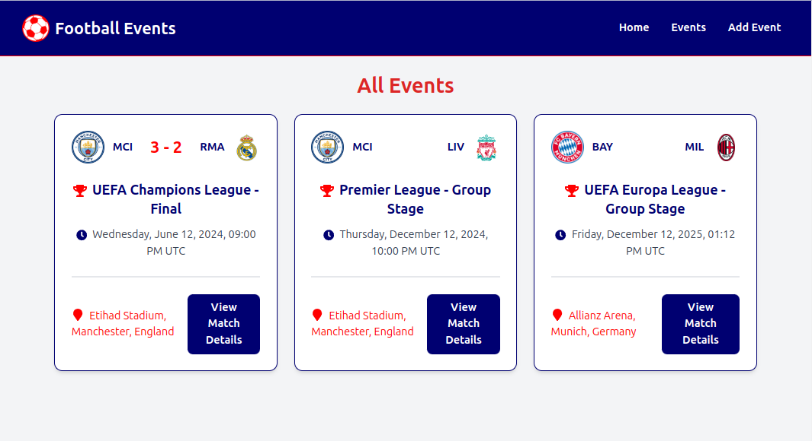

# Football Events Tracking Application

Welcome to the Football Events Tracking application, a complete solution for managing football matches and events. This application features a React.js frontend, Spring Boot backend, and a MySQL database running in Docker. This project is solution for Sportradar recruitment backend exercise.

## Project Overview

This Football Events Tracking Application allows users to add, update, and manage events such as football matches, goals, cards. 

## Features
- **Add and Manage Events**: Add new football matches, manage the participating teams, and set up event details.
- **Track Goals and Cards**: Keep records of goals, yellow cards, and red cards during the match.
- **Match Timeline Visualization**: Visual representation of match events, including goals and cards.
- **User-friendly UI**: A React.js-based frontend designed for ease of use.
- **REST API Integration**: Backend developed in Spring Boot for reliable API interaction.
- **MySQL Database**: Dockerized MySQL instance to store match details, ensuring easy setup and management.

## Architecture

The application is built using a **client-server** architecture. The frontend is developed using **React.js** and communicates with a **Spring Boot** backend. The backend interacts with a **MySQL** database containerized using **Docker**. The architecture ensures scalability, easy maintenance, and clean separation of concerns.


## Tech Stack

- **Frontend**: React.js, Axios
- **Backend**: Java Spring Boot, Spring Data JPA
- **Database**: MySQL (Dockerized)
- **API Integration**: RESTful services
- **Deployment**: Docker, Docker Compose

## Screenshots

### Home Page


### Event Details Page


### Event Timeline Page


### Edit Event Page


### Add Event Page


### All Events Page



## Setup Instructions

### Prerequisites

- **Java 11** or higher
- **Node.js** and **npm/yarn**
- **Docker** and **Docker Compose**

### Backend Setup (Spring Boot)

1. **Clone the repository**:
   ```sh
   git clone <repository-url>
   cd football-events-backend
   ```

2. **Build the backend**:
   ```sh
   ./mvnw clean install
   ```

3. **Run the application**:
   ```sh
   ./mvnw spring-boot:run
   ```

### Frontend Setup (React)

1. **Navigate to the frontend directory**:
   ```sh
   cd ../football-events-frontend
   ```

2. **Install dependencies**:
   ```sh
   npm install
   ```

3. **Run the development server**:
   ```sh
   npm start
   ```

### MySQL Database Setup with Docker

1. **Navigate to the root directory** containing the Docker Compose file.

2. **Run Docker Compose** to set up the MySQL container:
   ```sh
   docker-compose up -d
   ```

3. **Access MySQL** via any MySQL client tool using the connection details from `docker-compose.yml`.

### Docker Compose Configuration

The `docker-compose.yml` includes configuration for a MySQL instance, ensuring all database operations are containerized.

```yaml
version: '3.8'
services:
  db:
    image: mysql:8
    environment:
      MYSQL_ROOT_PASSWORD: root
      MYSQL_DATABASE: football_events_db
    ports:
      - "3306:3306"
    volumes:
      - db_data:/var/lib/mysql
volumes:
  db_data:
```

## Database Diagram

The MySQL database is designed following the **Third Normal Form (3NF)** to ensure efficient data storage and eliminate redundancy. Below is the ER diagram representing the core entities:


## Future Enhancements

- **User Authentication**: Introduce role-based access to manage administrative privileges.
- **Team Management Module**: Allow admins to create and manage teams, including updating rosters.
- **Reporting and Analytics**: Add a dashboard for visualizing statistics such as total goals, cards, and other metrics.

## Contact
For any questions or feedback, reach out to:
- **GitHub**: [ratep99](https://github.com/ratep99)
- **LinkedIn**: [Petar Petković](https://www.linkedin.com/in/petarpetkovic99/)

